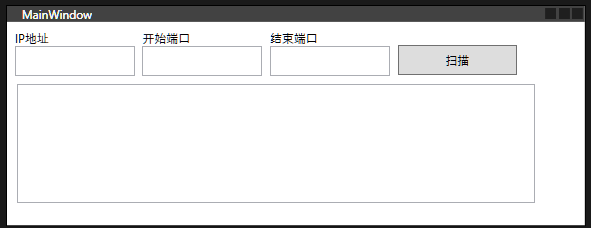

# 桌面应用：WPF

虽然WinForm可以很方便的开发工具应用，但在某些方面有很大的不足，WPF是微软为应对现代化编程推出的桌面应用开发的新技术，它是基于XAML的，可以很方便的实现复杂的界面设计。

我们目前并不需要去详细了解它，还是通过 端口扫描工具，先来感受一下WPF的开发。

## 创建项目

我们仍然使用之间的解决方案，在解决方案中创建新项目，选择`WPF应用程序`，项目名称为`WpfApp`。

## 界面设计与排版

WPF使用XAML，不同于WinFrom的拖动(绝对定位)，它可以使用其他更灵活(更麻烦)的方式进行排版，常见的是通过`Grid`布局。
直接看布局的代码:

```xml
<Window
    x:Class="WpfApp.MainWindow"
    xmlns="http://schemas.microsoft.com/winfx/2006/xaml/presentation"
    xmlns:x="http://schemas.microsoft.com/winfx/2006/xaml"
    xmlns:d="http://schemas.microsoft.com/expression/blend/2008"
    xmlns:mc="http://schemas.openxmlformats.org/markup-compatibility/2006"
    xmlns:local="clr-namespace:WpfApp"
    mc:Ignorable="d"
    Title="MainWindow"
    Height="220"
    Width="580">
    <StackPanel
        Height="200"
        Width="540"
        HorizontalAlignment="Left"
        VerticalAlignment="Top"
        Orientation="Vertical">
        <StackPanel
            Margin="8"
            Orientation="Horizontal"
            HorizontalAlignment="Left">
            <!--ip-->
            <StackPanel
                Orientation="Vertical">
                <TextBlock
                    Text="IP地址">
                </TextBlock>
                <TextBox
                    x:Name="ipBox"
                    TextWrapping="Wrap"
                    Height="30"
                    Width="120" />
            </StackPanel>
            <!--开始端口-->
            <StackPanel
                Margin="8,0,0,0"
                Orientation="Vertical">
                <TextBlock
                    Text="开始端口">
                </TextBlock>
                <TextBox
                    x:Name="startBox"
                    TextWrapping="Wrap"
                    Height="30"
                    Width="120" />
            </StackPanel>
            <!--结束端口-->
            <StackPanel
                Margin="8,0,0,0"
                Orientation="Vertical">
                <TextBlock
                    Text="结束端口">
                </TextBlock>
                <TextBox
                    x:Name="endBox"
                    TextWrapping="Wrap"
                    Height="30"
                    Width="120" />
            </StackPanel>
            <Button
                Margin="8,14,0,0"
                x:Name="scanBtn"
                Content="扫描"
                Height="30"
                Width="120">
            </Button>
        </StackPanel>
        <StackPanel>
            <TextBox
                x:Name="resultBox"
                Width="520"
                Height="120" />
        </StackPanel>
    </StackPanel>
</Window>
```

效果如下:



## 事件处理

现在我们可以编写点击扫描按钮的事件了，逻辑跟之前的`WinForm`是一样的，还是要先引用端口扫描的程序集，具体代码如下：

```csharp
public async void scanBtn_ClickAsync(object sender, RoutedEventArgs e)
{
    // 获取控件值 
    var ipStr = IPBox.Text;
    var startPortStr = startBox.Text;
    var endPortStr = endBox.Text;

    // 判断用户输入
    if (string.IsNullOrWhiteSpace(ipStr))
    {
        MessageBox.Show("ip不可为空");
    }

    if (string.IsNullOrWhiteSpace(startPortStr) || string.IsNullOrWhiteSpace(endPortStr))
    {
        MessageBox.Show("端口不可为空");
    }

    if (int.TryParse(startPortStr, out var startPort) && int.TryParse(endPortStr, out var endPort))
    {
        if (startPort > endPort)
        {
            MessageBox.Show("起始端口不可大于结束端口");
        }

        if (IPAddress.TryParse(ipStr, out var ip))
        {
            scanBtn.IsEnabled = false;
            resultBox.Text = "扫描中..";
            // 开始端口扫描
            var helper = new ScannerHelper(ip, startPort, endPort);

            // 使用Task.Run来异步执行ScanPortsTask方法
            var ports = await Task.Run(() => helper.ScanPortsTask());

            if (ports.Count > 0)
            {
                var content = string.Join(Environment.NewLine, ports);
                resultBox.Text = "开放的端口" + Environment.NewLine + content;
            }
            else
            {
                resultBox.Text = "扫描结束，没有开放的端口";
            }
            scanBtn.IsEnabled = true;
        }
        else
        {
            MessageBox.Show("ip地址不合法");
        }
    }
    else
    {
        MessageBox.Show("端口必须为数字");
    }
}
```

然后在`xaml`中扫描按钮中，添加点击关联的事件：

```xml
<Button
    Margin="8,14,0,0"
    x:Name="scanBtn"
    Content="扫描"
    Height="30"
    Width="120"
    Click="scanBtn_ClickAsync">   <!-- 新添加的行 -->
</Button>
```

我们可以看到，代码几乎是一样的，我们运行程序看一下效果。

## 发布程序

使用`VS`可以非常方便的发布程序，具体操作如下:

1. 右键项目，选择发布
2. 在弹窗中选择文件夹，下一步，选择ClickOnce发布
3. 选择要发布的路径，点击完成
4. 点击发布

## 安装和卸载程序

在目录中查看打包发布后的应用，我们会看到一个`setup.exe`文件，双击运行即可安装，这样该程序就作为一个应用安装到你的计算机了。

你可以在开始菜单中找到它，然后卸载它。

## 总结

我们可以看到WPF似乎与`WinForm`没有什么区别，这是因为我们的程序很简单，逻辑本身也是共用的，在实际开发应用时，在界面开发以及复杂的交互上，会有巨大的区别，完全是不同的开发模式。

`VS`仍然提供了一流的体验，在发布应用方面提供了一致的体验。

> [!TIP]
> WPF中使用MVVM模式来开发应用，这是一种非常好的设计模式，可以很好的分离界面和逻辑，使得代码更加清晰，易于维护。
