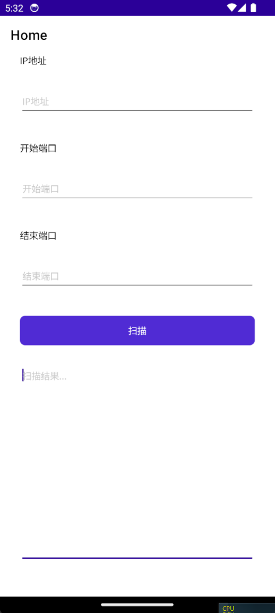
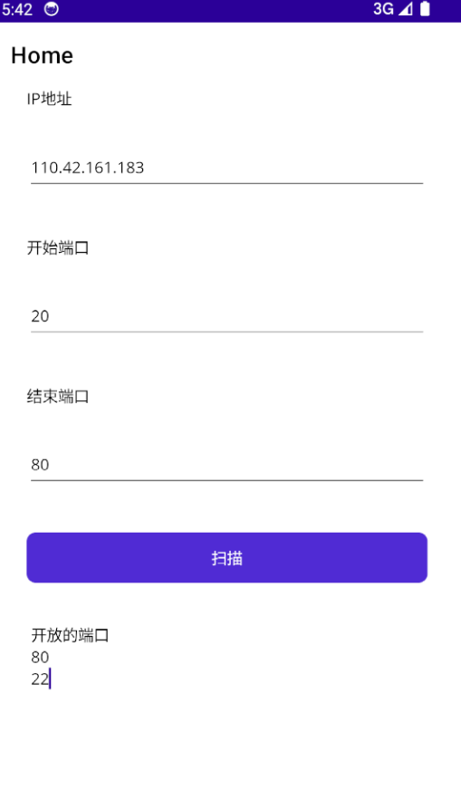

# 跨平台应用：MAUI

MAUI是微软推出的一款跨平台应用开发框架，它是Xamarin.Forms的下一代版本，旨在为.NET开发人员提供一种统一的方式来构建跨平台应用程序。MAUI支持Android、iOS、MacOS、Windows和Linux等多个平台，开发人员可以使用C#和XAML来构建应用程序，同时还可以使用.NET 6中的新功能和API。

简单一句话就是：

使用C#我们也可以开发

- Android应用
- iOS应用
- MacOS应用
- Windows应用
- Linux应用(暂不支持GUI)。

同样的，对于逻辑部分，我们可以共用很多内容，但在UI和特殊的跟系统紧密相关的功能，还是要根据不同平台进行特殊的处理。

> [!TIP]
> 在MAUI之前，微软还推出了`UWP`技术，但就当不存在，因为已经放弃了。目前Windows开发还是`WPF`为主力，更新型的应用可以使用`WinUI`。

## 开发Android版端口扫描工具

接下来，我们将演示使用MAUI技术栈来开发一个简单的Android工具。

1. 安装MAUI工作负载
2. 创建MAUI项目`PortScannerMaui`
3. 删除不需要支持的目标平台

## 页面布局

MAUI仍然使用`XAML`相关技术来设置页面布局，我们修改`MainPage.xaml`中的代码如下:

```xml
<?xml version="1.0" encoding="utf-8" ?>
<ContentPage xmlns="http://schemas.microsoft.com/dotnet/2021/maui"
             xmlns:x="http://schemas.microsoft.com/winfx/2009/xaml"
             x:Class="PortScannerMaui.MainPage">
    <ScrollView>
        <VerticalStackLayout
            Padding="30,0"
            Spacing="25">
            <Label
                Text="IP地址" />
            <Entry
                Margin="0,4,0,0"
                x:Name="IPBox"
                Placeholder="IP地址" />
            <Label
                Margin="0,12,0,0"
                Text="开始端口" />
            <Entry
                Margin="0,4,0,0"
                x:Name="startBox"
                Placeholder="开始端口" />
            <Label
                Margin="0,12,0,0"
                Text="结束端口" />
            <Entry
                Margin="0,4,0,0"
                x:Name="endBox"
                Placeholder="结束端口" />
            <Button
                Margin="0,12,0,0"
                x:Name="CounterBtn"
                Text="扫描"
                SemanticProperties.Hint="Counts the number of times you click"
                Clicked="OnCounterClicked"
                HorizontalOptions="Fill" />
            <Editor
                x:Name="resultBox"
                Placeholder="扫描结果..."
                AutoSize="TextChanges"
                VerticalOptions="StartAndExpand"
                HorizontalOptions="FillAndExpand"
                HeightRequest="300" />
        </VerticalStackLayout>
    </ScrollView>
</ContentPage>
```

我们使用`Android`模拟器来运行程序，我们会看到以下页面:



## 逻辑实现

现在我们来为按钮添加事件处理逻辑，我们修改`MainPage.xaml.cs`中的代码如下:

```csharp
private async void OnCounterClicked(object sender, EventArgs e)
{
    // 获取控件值 
    var ipStr = IPBox.Text;
    var startPortStr = startBox.Text;
    var endPortStr = endBox.Text;

    // 判断用户输入
    if (string.IsNullOrWhiteSpace(ipStr))
    {
        await DisplayAlert("", "ip不可为空", "");
    }

    if (string.IsNullOrWhiteSpace(startPortStr) || string.IsNullOrWhiteSpace(endPortStr))
    {
        await DisplayAlert("", "端口不可为空", "");
    }

    if (int.TryParse(startPortStr, out var startPort) && int.TryParse(endPortStr, out var endPort))
    {
        if (startPort > endPort)
        {
            await DisplayAlert("", "起始端口不可大于结束端口", "");
        }

        if (IPAddress.TryParse(ipStr, out var ip))
        {
            CounterBtn.IsEnabled = false;
            resultBox.Text = "扫描中..";
            // 开始端口扫描
            var helper = new ScannerHelper(ip, startPort, endPort);

            // 使用Task.Run来异步执行ScanPortsTask方法
            var ports = await Task.Run(() => helper.ScanPortsTask());

            if (ports.Count > 0)
            {
                var content = string.Join(Environment.NewLine, ports);
                resultBox.Text = "开放的端口" + Environment.NewLine + content;
            }
            else
            {
                resultBox.Text = "扫描结束，没有开放的端口";
            }
            CounterBtn.IsEnabled = true;
        }
        else
        {
            await DisplayAlert("", "ip地址不合法", "");
        }
    }
    else
    {
        await DisplayAlert("", "端口必须为数字", "");
    }
}
```

可以看到，代码也几乎是一样的，只是提示框的方法不同。

然后我们重新运行程序，输入IP地址、开始端口和结束端口，点击扫描按钮，我们会看到扫描结果。



## 发布应用

如果我们想在自己的手机上安装应用，可以先将应用发布成`apk`。

我们先配置配置一下Android发布的选项，比如目标平台，发布成`apk`文件。

选择`Release`选项，然后右键项目，点击发布。

我们现在已经有了`apk`文件，但是它是未经签名的，所以可能不会安装成功，我们可以在`VS`中点击分发，去添加签名信息，之后将签名后的文件复制到手机中，就可以安装了。

## 总结

我们以`Android`平台为例子，演示了使用C#在.NET平台下开发跨平台应用的方法。同一套代码，我们也可以发布到Windows平台。

单纯从代码内容角度上看，我们将`ScannerHelper`类单独放到一个类库项目中，这样其他的项目都可以使用它，而不需要重复的编写，这就是对代码的封装和复用。

目前我们演示的应用，其实都属于客户端应用(C/S架构)，只是可以在不同的系统中运行。它们可以直接调用系统的功能。

还有一类我们最常见的应用类型，就是浏览器应用(B/S架构)，这些应用是运行在浏览器中的，并不能直接调用操作系统的功能。在这些领域，.NET也提供了非常丰富的技术栈和解决方案，帮助我们解决各类问题。
