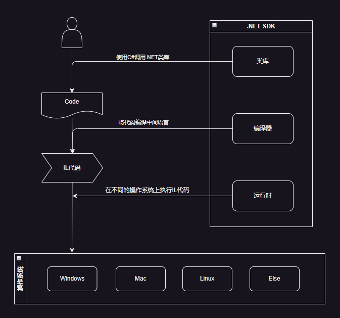

# C#与.NET SDK与操作系统

我们使用各种语言编写的绝大部分程序，最终都是在操作系统上运行的，用户使用软件的流程大概如下：

`用户->操作系统(提供应用程序运行环境)->驱动->各类硬件`

那么，对于开发者，如何通过编程语言使用操作系统提供的能力呢？所有的功能难道要我们自己去直接调用指令操作硬件么？

操作系统功能繁多且复杂，难道要穷举出来，全部封装成函数么？我们已经了解了面向对象的思维，语言提供商通过SDK的方式，把操作系统的功能封装成类库，让开发者更方便的使用。

## 关系

我们先通过一张图来看一下它们之间的关系：

当我们谈论某个编程语言时，它被开发者所使用，并最终成本在操作系统中运行的程序，其背后是一系列的技术支持，而不仅仅是语言的语法和语义。

对于现代的编程语言，通常它都包括`SDK`，比如JAVA叫做`JDK`。

SDK通常包含了：

- 语法解析器，分析器
- 编程语言的`编译器`
- `类库`
- `运行时`
- 相关文档

它们为开发、调试、运行提供了支持。

整体可以概括为:

开发者(借助SDK类库)编写代码，交付给`SDK`(编译器)，而`SDK`编译后通过`运行时`运行它。

`SDK`(运行时)根据不同的`操作系统`和`CPU架构`来执行代码。

> [!TIP]
> 早些时候，微软和苹果是少有的同时拥有`操作系统`，`编程语言`和`开发工具`的公司。现在包括谷歌、华为(勉强)都具备了类似的能力，当然在当下的场景下，还需要具备提供`云资源和服务`，`AI`以及`芯片设计`的能力。毫无疑问，微软是其中能力最完备和出众的公司，而这些最后都给转换成.NET的能力提供给开发者。

## 生活示例

比如我们现在买一台电脑，我们打开购物APP

用户：搜索电脑。

APP提供快速筛选：品牌、CPU、价格、内存、硬盘

用户：选择品牌、CPU、价格、内存、硬盘，搜索

APP：提供商品列表

用户：选择一款电脑，下单付款

物流：发货并运送。

### 类比

我们解析一下购物过程，它跟我们讲的C#/.NET SDK/以及操作系统有类似的关系。

- 购物软件提供了各个维度的筛选条件，帮助我们更快更好的描述需求，就类似于`SDK`提供了`常用类库`，帮助快速实现需求。
- 购物软件通过搜索匹配把筛选需求转换为商品列表，就类似于`SDK`编译器，把原始代码编译成`可运行`的中间代码或`原生代码`。
- 当我们下单付款后，商家开始执行成单操作，即准备商品安排发货。这个过程就类似于`SDK运行时`开始执行程序。
- 而发货的过程，我们并不需要关心发货的地点、仓库以及实际运送的快递，而是预计到货时间。也就相当于，我们并不用关心`SDK`运行时的`操作系统`和`CPU架构`，只关心它的功能正常运行。

你只要想到购物的过程，就可以类比出来以上的关系。

## 关于操作系统

我们知道，从服务器到个人电脑以及手机，或者只是一个简易的设备，只要是能运行程序，那一定是有操作系统在提供支持。

也就是说，我们编写程序，实质上是我们通过开发工具(语言和SDK等)告诉操作系统要干什么。

而操作系统可以通过驱动程序来操作硬件，从而让硬件执行我们在代码中描述的操作。

到此，我们大概是补全了整个流程，无论我们是开发软件还是使用软件，通常是与操作系统进行交互，而操作系统则是与硬件进行交互，最终由硬件执行我们想要的操作。

## 总结

无论是编程语言，还是其他技术的发展，都有一个隐含的逻辑线，那就是人的需求日益多样和复杂(释放人性，追求自由)，为了满足或创造需求，技术也在不断的发展和改进。
