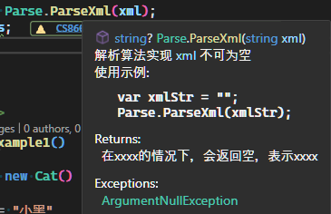
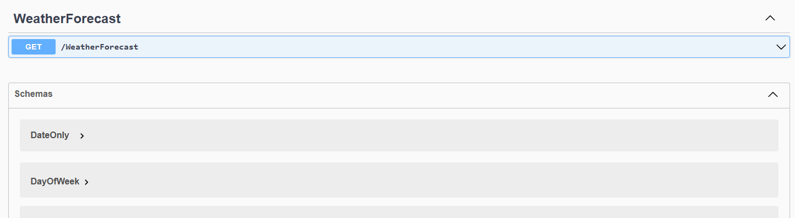
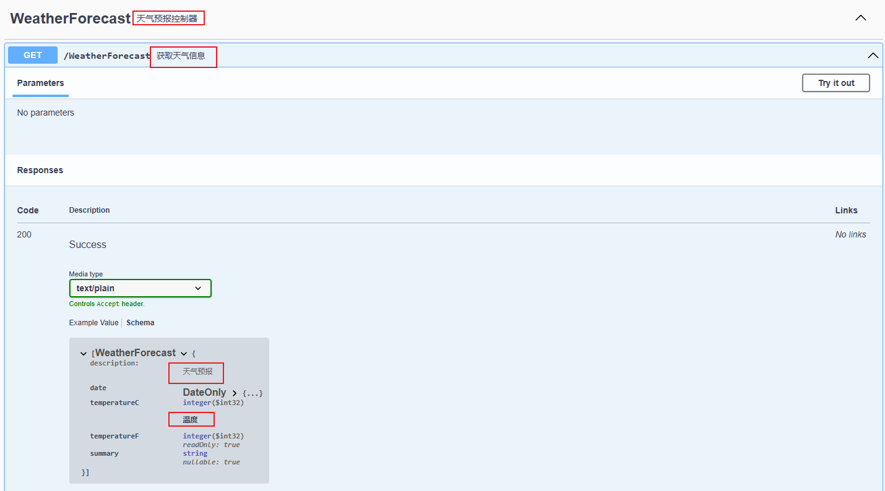

# C#中的注释

## 基本注释

通常编程语言都支持对代码进行单选或多行注释，如

```csharp
// 代码注释
public static void CodeComment()
{
    var a = 1; // 单选注释
    /* 
     * 多行注释
     * var b = 2;
     * var c = 3;
     */

    //var b = 2;
    //var c = 3;
}
```

## XML文档注释

XML文档注释是一种特殊的注释，它以`///`开头，通常用于对`类、接口、方法、属性`等代码元素进行注释。`xml`提供了一种更加丰富的语法表达，利用它，我们可以实现很多其他的功能，来提升开发体验。

如，我们定义一个方法，并添加上注释:

```csharp
/// <summary>
/// 解析算法实现
/// <paramref name="xml"/> 不可为空
/// <br/>
/// <example>
///    使用示例:
/// <code>
///    var xmlStr = "";
///    Parse.ParseXml(xmlStr);
/// </code>
/// </example>
/// </summary>
/// 
/// <param name="xml" > 不可为空的xml格式字符串</param>
/// <returns>在xxxx的情况下，会返回空，表示xxxx</returns>
/// <example> parseXml("content")</example>
/// <exception cref="ArgumentNullException">xml为空字符串时</exception>
public static string? ParseXml(string xml)
{
    // TODO：具体实现
    if (string.IsNullOrWhiteSpace(xml))
    {
        throw new ArgumentNullException(nameof(xml), "空字符串");
    }
    return xml;
}
```

当我们调用该方法时，我们将获取丰富的提示信息，如：



### 注释跳转

在注释中，我们可以使用`<see cref=""/>`标签来实现跳转，如：

```csharp
/// <summary>
/// 解析
/// </summary>
/// <param name="xml"></param>
/// <see cref="Parse.ParseXml(string)" href="http://blog.dusi.dev"/>
/// <returns></returns>
public string Example(string xml)
{
    // TODO:预处理
    var res = Parse.ParseXml(xml);
    return res;
}
```

在我们使用该方法时，可以跳转到其他关联的方法，这样可以方便我们查看相关的代码。或者使用`href`属性来指定跳转的链接，比如更加详细的说明文档。

可以在`DTO`类中添加对原始类型的引用，方便对比查看。

### 注释继承

在`C#`中，我们可以使用`<inheritdoc/>`标签来继承父类的注释，如：

```csharp
public interface IAnimal
{
    /// <summary>
    /// 发声
    /// </summary>
    /// <param name="content"></param>
    void Speak(string content);
}
public class Animal : IAnimal
{
    public required string Name { get; set; }

    /// <summary>
    /// 动物叫
    /// </summary>
    /// <param name="content"></param>
    public virtual void Speak(string content)
    {
        Console.WriteLine("发音:" + content);
    }
}

public class Cat : Animal
{
    /// <inheritdoc cref="IAnimal.Speak"/>
    public override void Speak(string content)
    {
        base.Speak("猫叫:" + content);
    }
}
```

## 生成文档

我们演示了几种最常见的注释的使用方法和场景，更多更详细的用法，请查看[官方文档](https://learn.microsoft.com/zh-cn/dotnet/csharp/language-reference/xmldoc/recommended-tags).

通常对于一个项目，注释的行数占比是很大的，甚至是超过代码的行数，但这些注释对于代码运行没有任何作用，在程序编译时，去移除这些注释，能显著减少程序体积。

.NET提供了一种方式将所有的`xml注释`生成一个文件，以便提供给其他工具使用。

### 生成文档文件

在项目配置中，找到构建中的输出选择，选择生成`XML文档文件`，或者直接在`.csproj`中添加

```xml
<PropertyGroup>
    <!-- ... -->
    <GenerateDocumentationFile>True</GenerateDocumentationFile>
</PropertyGroup>
```

这样在构建时，我们就会看到生成的`xml`文件了，那么其他的工具就可以使用这个文件来进一步生成文档了。

## 使用DocFX生成文档

想必大家都看过微软的官方文档，.NET SDK为开发者提供了丰富的功能，我们除了使用IDE的提示来了解相关类方法的使用，还可以通过官方文档更加详细的了解使用细节。要想维护多个版本的文档，全部手动重新编写是非常繁琐的，尤其是很多内容是已经在代码注释中写好的。

如果我们自己编写了一个类库，那么我们也希望其他人在不使用的情况下就能通过文档了解我们程序中的方法和类的使用，这时我们就可以使用`DocFX`来生成文档。

`DocFX`是一个开源的文档生成工具，现已成为.NET基金会项目，它可以通过代码注释生成文档。

我们将使用它演示，将我们的程序集生成文档网站。

### 安装该工具

```pwsh
dotnet tool install -g docfx
```

### 初始化项目

我们可以先创建一个`docs`文件夹用来存放文档，在该目录下执行:

```pwsh
docfx init 
```

根据提示，输出相关的内容，如:

```pwsh
Name (mysite): AdvanceExample
Generate .NET API documentation? [y/n] (y): y
.NET projects location (src): CsharpAdvance
Markdown docs location (docs): docs
Enable site search? [y/n] (y): y
Enable PDF? [y/n] (y): n
```

这时我们会看到生成了配置文件`docfx.json`.

然后我们执行`docfx`命令，等待执行完成，这样我们就生成了文档，然后我们可以通过以下命令来预览：

```pwsh
docfx .\docfx.json --serve
```

打开链接，找到API文档，然后找到命名空间`CsharpAdvance.XmlComment`，查看`Parse`类，我们可以看到，我们之前在代码中写的注释，都以某种方式显示在页面当中了。

> [!TIP]
> docFX还包含其他功能，如生成PDF文档，生成静态网站等，更多功能请查看[官方文档](https://dotnet.github.io/docfx/)

## Swagger生成接口文档

在Web API开发中，我们可以使用`Swagger`来生成接口文档，同时通过`Swagger UI`来测试接口。`Swagger`同样可以通过读取`xml`文档来生成更多的信息，方便查看。

### 创建项目

我们可以创建一个`ASP.NET Core WebAPI`项目，如命名为`SwaggerExample`，选中`启用OpenAPI`支持。

现在我们使用`dotnet watch run`命令来运行项目，项目会自动打开浏览器窗口，展示`swagger UI`页面，如：



### 添加XML文档信息

接下来，我们让swagger 可以读取并使用我们的`xml`文档。

1. 在项目文件`.csproj`里添加`<GenerateDocumentationFile>True</GenerateDocumentationFile>`以启用xml文档的生成。
2. 修改`Program.cs`中`builder.Services.AddSwaggerGen()`为以下内容：

    ```csharp
    builder.Services.AddSwaggerGen(options =>
    {
        var xmlFile = $"{Assembly.GetExecutingAssembly().GetName().Name}.xml";
        var xmlPath = Path.Combine(AppContext.BaseDirectory, xmlFile);
        options.IncludeXmlComments(xmlPath, true);
    
    });
    ```

3. 为控制器、方法以及类型添加xml注释内容。
4. 重新运行程序，再次查看swagger页面，它将显示以下内容：

    

## 总结

C#中提供使用`XML`这种强大且`通用`的文本标记方式来编写注释，同时可以将它生成独立的文件，这样我们就可以将该文件进行保存和传播，提供给其他工具使用。

在实际开发过程中，尽可能的编写注释代码，可以不全面，但尽可能要有。