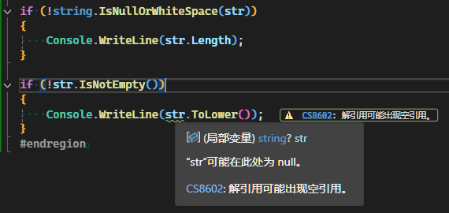

# 使用扩展方法

扩展方法是备受好评的语言特性，通过它，我们可以非常灵活的扩展现有类型的功能。

## 字符串方法示例

C#提供了一些方法用来判断字符串为空，如：

```csharp
Console.WriteLine(string.IsNullOrEmpty("   ")); // false
Console.WriteLine(string.IsNullOrWhiteSpace("   ")); // true
```

在日常处理中，我们经常要过滤掉"空字符串"，认为它是无效的输入，包括纯空格，显然我们需要使用`IsNullOrWhiteSpace`方法更合适。

`IsNullOrWhiteSpace`是`String`类中的静态方法，使用起来还是有些麻烦，如果我们可以直接对`string`类型调用该方法就好了。

如：

```csharp
var str = "";
if (str.IsNotEmpty()) 
{
    // do something
}
```

这样写起来更加方便，阅读起来也更加直观，当不为空时，然后执行某些操作。

此时我们就可以借助扩展方法来实现这个功能。

## 实现字符串扩展方法

我们新创建一个类`StringExtensions`，并添加一个静态方法`IsNotEmpty`：

```csharp
/// <summary>
/// 扩展方法
/// </summary>
public static class StringExtension
{
    /// <summary>
    /// 判断是否为空字符串
    /// </summary>
    /// <param name="str"></param>
    /// <returns></returns>
    public static bool IsNotEmpty(this string? str)
    {
        return !string.IsNullOrEmpty(str);
    }
}
```

这里需要注意的是，必须是`静态类`和`静态方法`，名称是自己定义的。

在方法，我们使用了`this`关键词，它表示的是调用该方法时的对象，将它作为参数以便在方法内部使用。

然后我们来对比以下代码：

```csharp
if (!string.IsNullOrWhiteSpace(str))
{
    Console.WriteLine(str.Length);
}

if (str.IsNotEmpty())
{
    Console.WriteLine(str.ToLower());
}
```

此时，我们会发现编辑器提示：



这表示string类提供的`IsNullOrWhtieSpace`方法，IDE是可以分析出它在后续的代码块中是不为空的，但我们自己定义的，它没有分析出来。
当我们查看`IsNullOrWhtieSpace`的源代码实现时，我们就能看到，它添加了一个`[NotNullWhen(false)]`特性，通过这个特性，IDE可以解析知道当返回值为`false`时，参数不为空。

现在，为我们自己的扩展方法添加该特性:

```csharp
public static bool IsNotEmpty([NotNullWhen(true)] this string? str)
{
    return !string.IsNullOrEmpty(str);
}
```

现在编辑器已经能够理解我们的意图，而不再有提示了。

## 总结

我们通过编写字符串的扩展方法，演示了如何在C#中定义和使用扩展方法。

在不修改原有类的情况下，我们可以为现有类型添加新的方法，增强其功能，直接在对象上调用扩展方法，而不是通过辅助类或静态方法，使代码更加简洁和直观。

