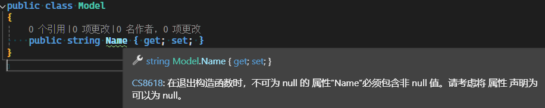
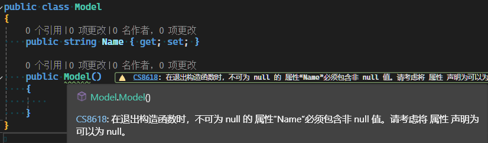
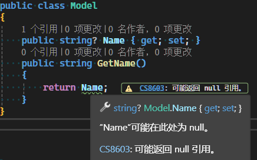

# 空值处理

空值处理是非常重要的，根据不同的统计和研究，大约 20% 到 50% 的运行时错误都可以归因于空指针异常。不同的编程语言对空值或空引用的处理程度不同，C#在这个方面做了大量的工作，以帮助我们消除相关的问题。

## 可空类型

我们已经看到过在类型后面跟着`?`的写法，以表示该变量或属性是可空的，如

```csharp
public int? Age{ get; set; }
public DateTimeOffset? Birthday { private get; init; }
```

在定义时，明确指出哪些属性是可空或非空，那么在编写代码时，解析器会帮我们检查是否有空值的情况，如果有，编译器会提示我们进行处理。如：





以上示例，`Name`不是可空的，当我们没有进行赋值或初始化时，编译器会提示我们进行处理。

---

我们来看一个可空的示例：



我们定义`Name`为可空的，但`GetName`的返回类型是`String`，意味着返回的是一个非空的字符串，当我们返回`Name`时，编译器会提示我们进行处理。

## 空合并运算符（Null Coalescing Operator）

空合并运算符是一个二元运算符，用于定义默认值，当左侧的操作数为`null`时，返回右侧的操作数，如上述代码，如果我们想消除警告，确保`GetName`返回的是个非空的字符串，我们可以使用空合并运算符，如：

```csharp
public string GetName()
{
    return Name ?? string.Empty;
}
```

其等效于：

```csharp
public string GetName()
{
    if (Name == null)
    {
        return string.Empty;
    }
    else
    {
        return Name;
    }
}
```

## 空合并赋值运算符 Conditional Operator）

空合并赋值运算符（??=）用于在变量为 null 时为其赋值。

```csharp
public void SetName(string newName)
{
    Name ??= newName;
}
```

以上代码设置姓名，只有当`Name`为空时，才会使用新名称，如果有名称了，就不会再赋值。

以上方法等效于:

```csharp
public void SetName(string newName)
{
    if (Name == null)
    {
        Name = newName;
    }
}
```

`??=`在写法上更加简洁和直观，不使用`if`判断为空的情况。

## 空值传播运算符（Null Conditional Operator）

空值传播运算符（?.）允许在链式调用时如果遇到 null，则整个表达式的结果为 null，而不会抛出异常。

查看以下示例：

```csharp
NullableExample.Model model = null;
var name = model?.Name ?? "未知";
Console.WriteLine(name);
```

以上代码，我们手动赋值model为null，以模拟实际情况可能为空的情况。比如 数据源是`json`，通过解析获得的数据可能为空。再比如从数据库中查询，而数据库中没有查询到任何信息，也可能返回null。

当我们后续使用`model?.Name`时，如果`model`为空，那么`model?.Name`也会为空，不会抛出异常。

如果我们使用`if`判断，大概需要如下处理：

```csharp
NullableExample.Model model = null;
string name = "未知";
if (model != null)
{
    if (model.Name != null)
    {
        name = model.Name;
    }
}
Console.WriteLine(name);
```

如果足够严谨，我们需要一层一层的进行空值判断，这样很容易形成`if`嵌套。

## required关键词

`required`关键词是C# 11.0中引入的，表示它所应用的字段或属性必须由`对象初始值设定项`进行初始化。

我们先来看下典型的模型定义代码：

```csharp
public class Person
{
    public string FirstName { get; }
    public string MiddleName { get; }
    public string LastName { get; }

    public Person(string firstName, string lastName, string? middleName = null)
    {
        FirstName = firstName;
        LastName = lastName;
        MiddleName = middleName ?? string.Empty;
    }
}
class Student : Person
{
    public int ID { get; }
    public Student(int id, string firstName, string lastName, string? middleName = null)
        : base(firstName, lastName, middleName)
    {
        ID = id;
    }
}
```

使用构造方法，存在大量需要手写的样板代码，在多个层次的继承中，这种情况会更加明显。而且想象一下，如果父类的构造参数修改，那么子类的也需要更改，这是多么大的负担。

有了`required`关键词，我们可以简化上述代码：

```csharp
public class PersonRequired
{
    public required string FirstName { get; init; }
    public string MiddleName { get; init; } = string.Empty;
    public required string LastName { get; init; }
}
public class StudentRequired : PersonRequired
{
    public required int ID { get; init; }
}
```

现在我们通过实例化来感受一下:

```csharp
var student = new Student(1, "张", "三");
var studentRequired = new StudentRequired()
{
    FirstName = "张",
    LastName = "三",
    ID = 1
};
```

使用`required`关键词能更明确的表示哪些属性是必须的，编译器会帮我们检查是否有未初始化的属性。

如果没有`required`，当存在多个构造方法，其中不包含必填属性的参数时，非空属性也可能为空，从而在运行是出错。

> [!TIP]
> 关于`required`关键词的产生的背景，以及解决的问题，请参考[官方文档](https://learn.microsoft.com/zh-cn/dotnet/csharp/language-reference/proposals/csharp-11.0/required-members).
