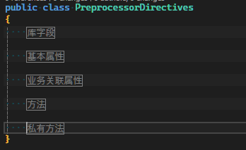

# 预处理指令

C#中的预处理指令用于在`编译之前`对源代码进行处理。它们通常用于控制代码的编译条件、定义符号、包含条件编译和错误指令等。

也就是说它会影响编译的行为，这里我们通过几个示例了解一下几个典型场景的应用，更多的内容可以参考[官方文档](https://docs.microsoft.com/zh-cn/dotnet/csharp/language-reference/preprocessor-directives)。

## 定义区域

使用`#region`与`#endregion`来定义可以折叠的代码区域，这样可以使代码更加清晰。如:

```csharp
public class PreprocessorDirectives
{
    #region 库字段
    public Guid Id { get; set; }
    public DateTimeOffset CreatedTime { get; set; }
    #endregion

    #region 基本属性
    public required string Title { get; set; }
    public string? Content { get; set; }
    #endregion

    #region 业务关联属性
    public List<string> Tags { get; set; } = [];

    /// <summary>
    /// 关于用户的id
    /// </summary>
    public Guid UserId { get; set; }
    #endregion

    #region 方法
    public void Save()
    {
        // 保存数据
    }
    #endregion

    #region 私有方法
    private void Load()
    {
        // 加载数据
    }
    #endregion
}
```

当我们进行折叠时，它显示如下：



当我们类中的代码非常多时，我们就可以通过定义不同的区域，来使代码更加清晰。

## 条件编译

条件编译是指根据不同的条件编译不同的代码，这里我们通过一个示例来了解一下：

```csharp
public static void Test()
{
#if DEBUG
    Console.WriteLine("开发调试时输出的内容");
#endif
    // _logger.Log("记录日志");
}
```

这里我们使用`#if DEBUG`，意思是在调试模式下才会输出`开发调试时输出的内容`，在发布模式下是不会输出的。这样可以避免将调试信息暴露给用户。

另一种常见的情况是，当我们自己编写类库时，如果想要支持不同的.NET版本，不同版本之间的API可能会有所不同，这时我们可以通过条件编译来实现，
如：

```csharp
static long GetUnixTimestamp()
{
#if NET6_0_OR_GREATER
    // .NET Core 实现
    return DateTimeOffset.UtcNow.ToUnixTimeSeconds();
#else
    // .NET Framework 实现
    DateTime epoch = new DateTime(1970, 1, 1, 0, 0, 0, DateTimeKind.Utc);
    return (long)(DateTime.UtcNow - epoch).TotalSeconds;
#endif
}
```

直接获取`linux时间戳`的方法是在`NET Core`之后才提供的，通过条件编译，我们可以针对不同版本使用不同的方法。
